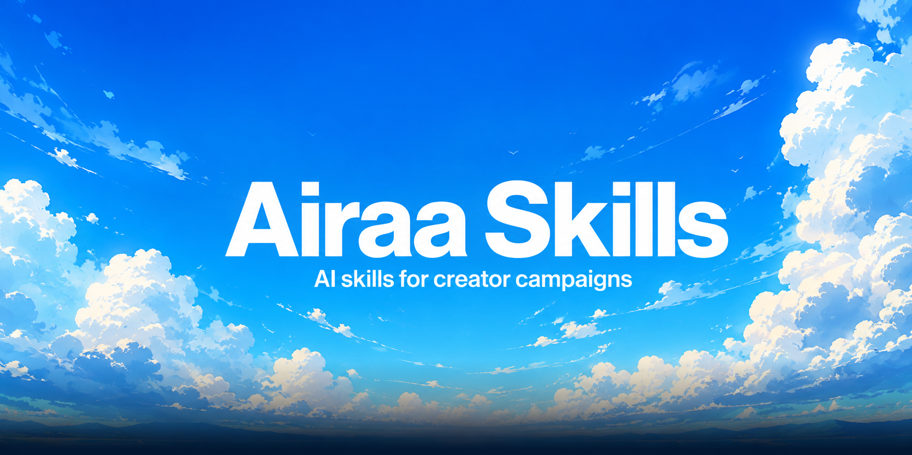

<!-- Banner — replace with your generated image -->
<p align="center">
  
</p>

<p align="center">
  <a href="https://airaa.xyz"></a>
  <a href="https://www.skills.sh/lightwaslost/Airaa-Skills"></a>
  
  <a href="https://github.com/lightwaslost/Airaa-Skills/stargazers"></a>
  <a href="LICENSE"></a>
  
</p>

<p align="center">
  <strong>AI skills that make you a better creator-campaign operator — powered by <a href="https://airaa.xyz">Airaa</a>.</strong>
</p>

---

## Install everything in one command

```bash
npx skills add lightwaslost/Airaa-Skills
```

> Works with Claude Code, Cursor, GitHub Copilot, Cline, Windsurf, and 15+ other AI tools.

---

## What is a skill?

A **skill** is a file that teaches your AI assistant how to do a specific job — step by step, using real playbooks and live data. Once installed, just talk naturally and it activates automatically.

Think of it as hiring an Airaa expert who already knows every campaign type, CPM benchmark, and brief format. You ask, they deliver.

---

## Available Skills

| | Skill | What it does | Trigger |
|--|-------|-------------|---------|
| 🎯 | [**airaa-campaign-planner**](./airaa-campaign-planner/) | 8-phase guided workflow: brand research → strategy → Q&A → budget → full brief → Airaa launch | *"I want to run a creator campaign"*, *"help me build a UGC brief"*, *"I want to go viral"* |

<details>
<summary>Coming soon</summary>

| | Skill | What it does |
|--|-------|-------------|
| 📊 | `airaa-analytics` | Read and act on campaign analytics dashboards |
| 👑 | `airaa-aura-board` | KOL strategy and Aura Board setup |
| 🏰 | `airaa-guild-setup` | Guild onboarding for brands running multiple campaigns |
| 🎬 | `airaa-creator-brief` | Creator-side onboarding and campaign instructions |

</details>

---

## Install options

### Option 1 — npx (recommended)

Requires Node.js. [Download here](https://nodejs.org) if you don't have it.

```bash
# Install all Airaa skills
npx skills add lightwaslost/Airaa-Skills

# Install a specific skill only
npx skills add lightwaslost/Airaa-Skills --skill airaa-campaign-planner

# Update when new skills drop
npx skills update
```

### Option 2 — Manual (Claude Code)

```bash
# macOS / Linux
cp -r airaa-campaign-planner ~/.claude/skills/

# Windows
xcopy airaa-campaign-planner %USERPROFILE%\.claude\skills\ /E /I
```

Restart your AI tool after copying.

---

## How to use once installed

Just talk to Claude naturally — skills activate on their own.

**Examples:**

```
"I want to run a creator campaign for my fitness app"
"Help me build a UGC brief — here's our site: airaa.xyz"
"How do I set up a clipping campaign?"
"We want creators to go viral for our launch"
```

Claude guides you through brand research → strategy options → 15-question Q&A → CPM recommendation → full brief with 10+ hooks → Airaa launch walkthrough.

---

## What is Airaa?

[Airaa](https://airaa.xyz) is the operating system for creator programs.

Brands use Airaa to run UGC, clipping, Instant Tasks, and KOL campaigns — with 48-hour USDC payouts, AI-powered content verification, and a persistent creator community that compounds across campaigns.

- **50,000+** verified creators on platform
- **TikTok · Instagram · YouTube · X**
- Pay per verified view — only pay for content you approve
- No invoices, no delays, no spreadsheets

[→ Read the docs](https://docs.airaa.xyz) &nbsp;·&nbsp; [→ Launch a campaign](https://app.airaa.xyz)

---

## Suggest a skill

Got an idea? [Open a skill request →](https://github.com/lightwaslost/Airaa-Skills/issues/new?template=skill-request.md)

---

<p align="center">
  Built by the <a href="https://airaa.xyz">Airaa</a> team &nbsp;·&nbsp;
  <a href="https://docs.airaa.xyz">Docs</a> &nbsp;·&nbsp;
  <a href="https://app.airaa.xyz">Launch a campaign</a> &nbsp;·&nbsp;
  <a href="https://twitter.com/airaa_xyz">Twitter</a>
</p>
